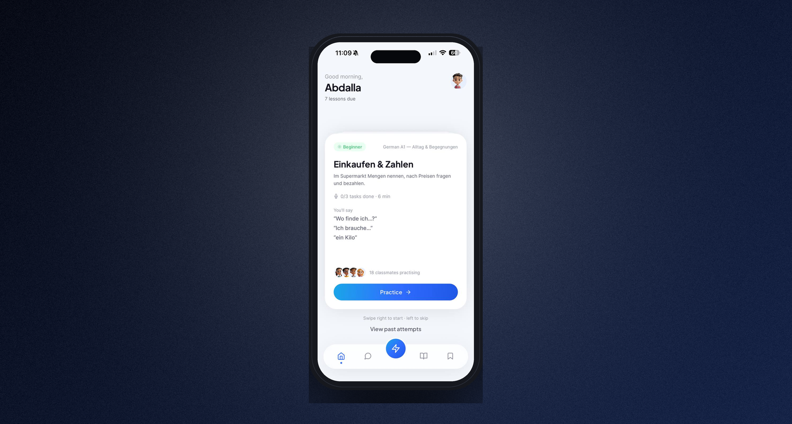

<div align="center">

# Launch Studio

**Turn raw app screenshots into store‑ready App Store, Google Play & Product Hunt visuals — right in your browser.**

_That ain’t no screenshot tool. It’s a dawg — drop ’em in._ 🐶

<p align="center">
  <a href="https://github.com/asera-1/launch-studio/actions/workflows/ci.yml"></a>
  <a href="https://launch-studio-three.vercel.app"></a>
  <a href="LICENSE"></a>
  
  
  
  
  
</p>

<a href="https://launch-studio-three.vercel.app"><b>Open the live app</b></a>
·
<a href="https://github.com/asera-1/launch-studio/issues">Report a bug</a>
·
<a href="https://github.com/asera-1/launch-studio/issues">Request a feature</a>

</div>

<br/>



## Overview

Every app or platform launch needs a fresh set of screenshots: the right sizes, on brand, with readable headlines. Doing that by hand is slow and has to be redone every release.

**Launch Studio turns it into a render job instead of a design task** — and it runs **100% in your browser**. There is no server, and your screenshots stay on your own machine — they're never uploaded: the render engine composes everything on a `<canvas>` locally, then hands you a ZIP. (The only exception is the optional AI headlines and translation features, which send text to OpenAI when you enable them with your own key.) Free, open source, no sign‑up.

> **Upload (or paste) your screenshots → pick a style → export a full, store‑ready kit in minutes.**

## ✨ Features

- **Three launch kits.** App Store, Google Play, and a landscape Product Hunt gallery — each at the exact required sizes.
- **Device frames.** A crisp iPhone frame (titanium / black / silver) and a **macOS Safari window** for web & platform products. Frames stay at true proportions and crop‑fill any screenshot — no stretching, no white gaps.
- **Paste to start.** Take a screenshot and hit `⌘V` / `Ctrl+V` — it drops straight in, no saving to disk.
- **Beautiful backgrounds.** 13 presets, a brand‑color picker, "match my screenshot" palette extraction, and gradient styles (diagonal, vertical, radial, conic, spotlight) with an adjustable film‑grain layer.
- **Typography.** Montserrat, Inter, Poppins, Sora, Archivo and Plus Jakarta. Montserrat is bundled; the others load from a CDN (jsDelivr / @fontsource) on first use.
- **Headlines that write themselves.** Optional AI copy (bring your own OpenAI key), **10‑language localization**, and full **RTL** (Arabic) rendering. AI copy and translation send text to OpenAI only when you turn them on, with your own key — everything else stays on your device.
- **A/B & preflight.** Generate colour/copy variants and run preflight checks before you ship.
- **One‑click export.** A ZIP with every size, a contact sheet, and a manifest. PNGs are flattened to opaque 24‑bit RGB so App Store Connect and Google Play accept them.
- **Autosave.** Your project and uploaded screenshots persist locally (localStorage + IndexedDB).

## ⚙️ How it works

A store screenshot is a stack of layers — background, device frame, the app screen, a status bar and a headline. Launch Studio is built around a small, framework‑agnostic **Canvas2D render engine** (`src/engine`) that composes those layers and swaps your screenshot in. Because it is pure canvas, the same engine renders in the browser today and could render in Node tomorrow.

Every export target is described declaratively:

| Store | Format | Size (px) |
| --- | --- | --- |
| App Store | iPhone 6.9" | 1290 × 2796 |
| App Store | iPhone 6.5" | 1242 × 2688 |
| App Store | iPad 13" | 2064 × 2752 |
| Google Play | Phone | 1080 × 1920 |
| Google Play | 10" tablet | 1600 × 2560 |
| Google Play | Feature graphic | 1024 × 500 |
| Product Hunt | Gallery | 1270 × 760 |

## 🧱 Tech stack

- **[Next.js 16](https://nextjs.org/)** (App Router) + **[React 19](https://react.dev/)**
- **[TypeScript](https://www.typescriptlang.org/)**
- **[Tailwind CSS 4](https://tailwindcss.com/)** + hand‑built shadcn/ui components
- **HTML Canvas 2D** render engine — no design tooling, no server
- **[JSZip](https://stuk.github.io/jszip/)** for export · **[Vercel](https://vercel.com/)** for hosting

## 🚀 Getting started

```bash
# 1. Clone
git clone https://github.com/asera-1/launch-studio.git
cd launch-studio

# 2. Install
npm install

# 3. Run
npm run dev        # http://localhost:3000
```

Build for production:

```bash
npm run build && npm start
```

> AI headlines and translation are optional and use your own OpenAI key, entered in the app — text is never sent anywhere but OpenAI. Everything else runs locally in your browser; the only other network request is loading extra fonts (Inter, Poppins, Sora, Archivo, Plus Jakarta) from a CDN on first use.

## 🗂️ Project structure

```
src/
├─ app/            # Next.js routes, metadata, icons, OG images
├─ components/     # Studio UI (editor, inspector, onboarding) + store icons
├─ engine/         # Canvas2D render engine
│  ├─ producthunt.ts   # Product Hunt templates (phone + Safari)
│  ├─ device.ts        # device frame + screen compositing
│  ├─ targets.ts       # store sizes & geometry
│  ├─ background.ts / themes.ts / color.ts / imgproc.ts
│  └─ director/        # AI + deterministic headline generation
└─ lib/            # IndexedDB + helpers
docs/              # README assets
```

## ☁️ Deploy

[](https://vercel.com/new/clone?repository-url=https%3A%2F%2Fgithub.com%2Fasera-1%2Flaunch-studio)

## 🗺️ Roadmap

- [x] App Store · Google Play · Product Hunt kits
- [x] iPhone + macOS Safari device frames (aspect‑aware, crop‑fill)
- [x] AI headlines (BYO key), 10‑language export, RTL
- [x] Paste from clipboard, autosave, A/B variants, preflight
- [ ] Browser‑frame option for the store kit
- [ ] Animated (GIF / MP4) gallery slides
- [ ] More device frames (Android, iPad landscape)
- [ ] Shareable templates & presets

## 🤝 Contributing

Contributions are welcome! Open an issue to discuss a change, or send a PR:

1. Fork the repo and create a branch: `git checkout -b feat/my-feature`
2. Commit your changes and push
3. Open a pull request

## 📄 License

Released under the [MIT License](LICENSE).

---

<div align="center">
Built with a keyboard and a dawg. If Launch Studio saved you an afternoon, drop a ⭐.
</div>
